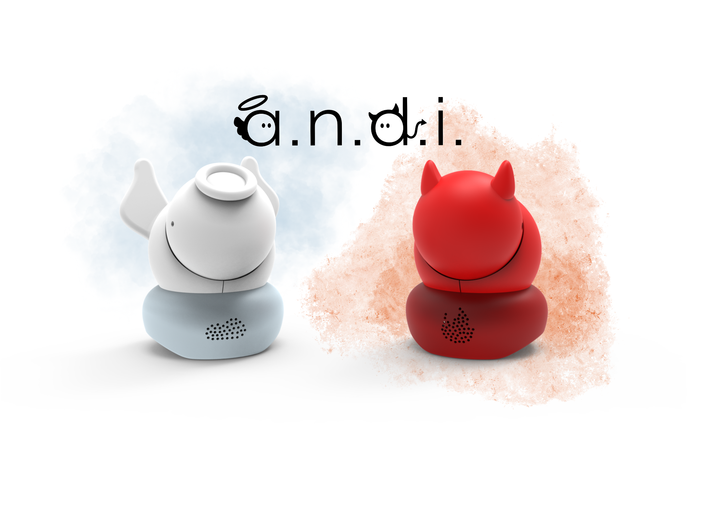

# Robotics and Design project
Make a wearable robot able to engage interactions with third people.

## Abstract
Text Text

## Electronics organization
Here are reported the wiring schema of the robot.

Built around a `Raspberry Pi 4B`, a `Raspberry Pi Protoboard` and an `Adafruit Stereo Speaker Bonnet`.

Input:
- 1 button
- 1 microphone
- 1 capacitive sensor
- 2 sonar sensors

Output:
- 2 speakers
- 6 servo motors

## Code organization
We wrote the code to test each electronic component independently in order to better understand their behaviour. We have programmed in Python since we are using a RaspberryPi.
The code of the tests can be seen in the folder [test](/test/).

The final code is int the main folder.

## Team
### Engineers

* __Giorgia Martelli__
* [__Tommaso Pozzi__](https://github.com/ToMmAzO)
* __Mehavannen Prabakaran__

### Designers

* __Erica Ceriotti__
* __Jacopo Ottaviani__
